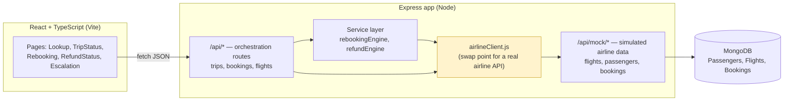

# Architecture

Single Express app hosting two route namespaces on top of one MongoDB
database — a simulated airline data service, and the app's own orchestration
API. The simulated service is the explicit swap point for a real airline
integration later.

**Swap point:** when a real airline integration becomes available, only
`airlineClient.js` changes — it currently calls `/api/mock/*` (backed by
Mongoose models), but the app-level routes and decision engines never touch
the mock routes or the database directly, so they don't need to change.

**Why one process instead of two services:** for a 48-hour MVP, running the
mock airline API and the app backend as separate deployments would add
operational overhead (two processes, two ports, two configs) without proving
anything the route-namespace separation doesn't already prove. The seam is in
the code, not the infrastructure.
