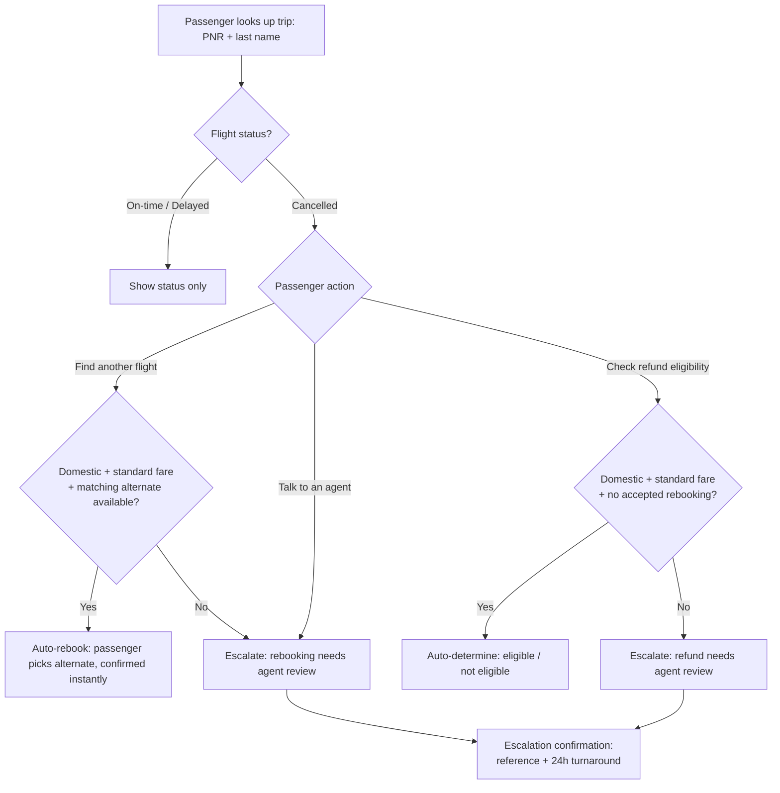

# Customer Journey

A passenger whose flight may be disrupted looks up their trip and, if it's
cancelled, is walked through rebooking or a refund check — with a clear exit
to a human agent at every point where the rules don't give a confident answer.

## Narrative

1. **Lookup.** The passenger enters their booking reference (PNR) and last
   name — no account or password needed. This mirrors what they'd read off a
   ticket or confirmation email.
2. **Trip status.** They immediately see their flight status. If it's on-time
   or delayed, that's the whole interaction — informational only, no action
   needed.
3. **Disruption actions.** If the flight is cancelled, they see up to three
   choices: *Find another flight*, *Check refund eligibility*, and *Talk to
   an agent* (always available, regardless of the other two).
4. **Rebooking.** The system checks whether an alternate flight on the same
   route, same cabin, with available seats exists — and whether the fare
   allows automatic rebooking at all (domestic + standard fare only). If so,
   the passenger picks a flight and is confirmed immediately. If not, they
   see why upfront (no guessing, no dead-end button) and can hand off to an
   agent with one click.
5. **Refund check.** Same idea: cancelled + standard fare + no accepted
   rebooking resolves instantly to an eligibility determination. International
   or special-fare cases are flagged for agent review instead of guessing.
6. **Escalation confirmation.** Any hand-off — from rebooking, from refund
   check, or the passenger clicking "Talk to an agent" directly — lands on
   the same confirmation screen with a reference number and expected
   turnaround, so the passenger always knows what happens next.

## Decision tree

